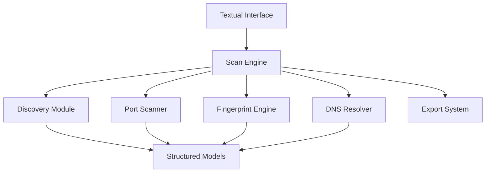
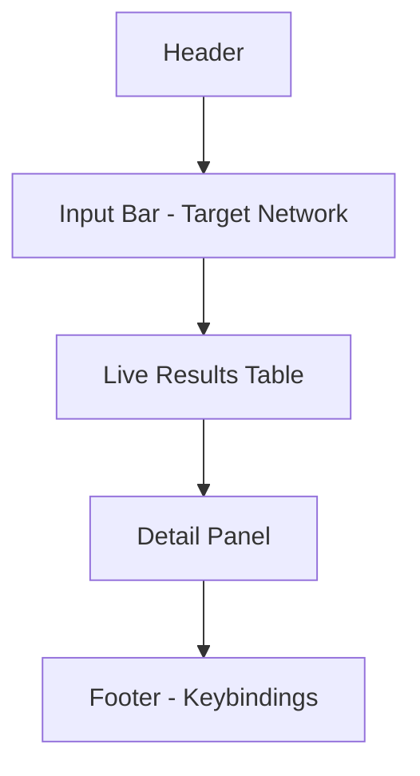
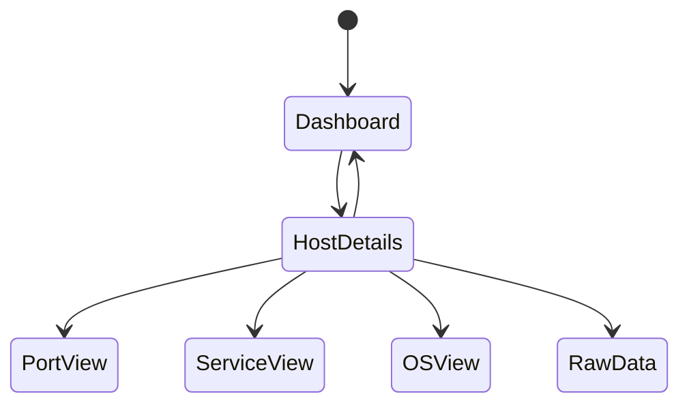
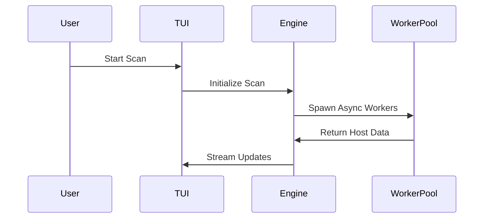
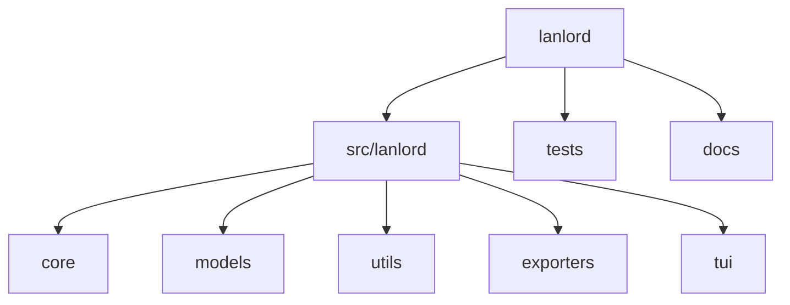
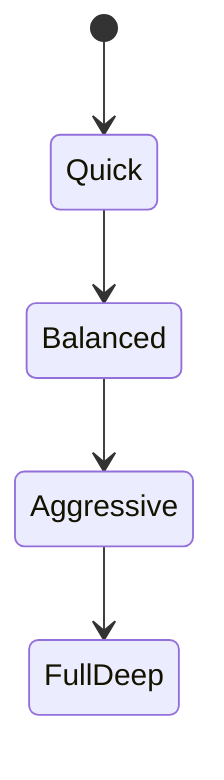

# LANLord

> Advanced Terminal-Based Network Intelligence Platform

LANLord is a full-screen terminal application built with Textual that delivers deep, structured, and real-time network reconnaissance inside a modern terminal interface.

It combines asynchronous scanning, structured data modeling, and a GitHub-inspired dark terminal theme to provide a professional-grade network analysis experience.

LANLord is not a command-line utility — it is a dedicated interactive TUI application.

---

# Overview

LANLord is engineered for:

* Network administrators
* Security researchers
* Infrastructure engineers
* Advanced lab environments

It provides comprehensive visibility into hosts, ports, services, and operating systems through an interactive terminal interface.

---

# Core Capabilities

## Host Discovery

* ICMP sweep
* TCP discovery
* ARP detection (local networks)
* Reverse DNS resolution
* MAC address detection
* Vendor lookup

## Port Scanning

* TCP connect scan
* SYN scan (privileged mode)
* UDP scan
* Banner grabbing
* Service detection
* Custom port ranges

## Fingerprinting

* OS detection via TTL heuristics
* Service version identification
* HTTP title extraction
* SSL metadata inspection (planned)

## Data Handling

* Structured result models
* JSON export
* CSV export
* HTML reporting (planned)

---

# Application Architecture



---

# Interface Layout



---

# Screen Navigation Model



---

# Execution Model

LANLord uses a fully asynchronous scanning engine with controlled concurrency.



Concurrency is regulated using semaphores to ensure:

* Controlled network load
* No socket exhaustion
* Stable performance on large CIDR ranges

---

# Project Structure



---

# Visual Design

LANLord uses a GitHub-inspired dark theme:

* Background: #0d1117
* Foreground: #c9d1d9
* Success: #3fb950
* Warning: #d29922
* Error: #f85149
* Accent: #58a6ff

All status indicators are color-coded:

* Alive → Green
* Dead → Red
* Filtered → Yellow
* Unknown → Gray

---

# Scan Profiles



### Quick

* Basic discovery
* Top common ports

### Balanced

* Full TCP scan (1–1024)
* Service detection

### Aggressive

* Extended port range
* OS detection
* Banner grabbing

### Full Deep

* All ports
* UDP scan
* Full fingerprinting

---

# Installation

## Requirements

* Python 3.10+
* Linux recommended for advanced scanning
* Elevated privileges required for SYN scanning

---

## Install from Source

```bash
git clone https://github.com/yourusername/lanlord.git
cd lanlord
pip install -e .
```

---

# Running LANLord

```bash
python -m lanlord
```

or after installation:

```bash
lanlord
```

This launches the full-screen interactive interface.

---

# Keybindings

| Key   | Action            |
| ----- | ----------------- |
| s     | Start scan        |
| r     | Rescan            |
| e     | Export results    |
| Enter | View host details |
| Esc   | Back              |
| q     | Quit              |

---

# Engineering Principles

* Async-first design
* Strict separation between UI and engine
* Typed data models (no raw dictionaries)
* Extensible scan strategy architecture
* Pluggable exporter system
* Test-driven core modules

---

# Testing

```bash
pytest
```

Core logic is testable independently of the TUI.

---

# Security Notice

LANLord is intended for:

* Authorized network environments
* Research and education
* Controlled internal infrastructure auditing

Unauthorized scanning of networks without permission may violate local laws.

---


# License

MIT License

---

# Author

Shashank Shekhar
Full Stack Developer

